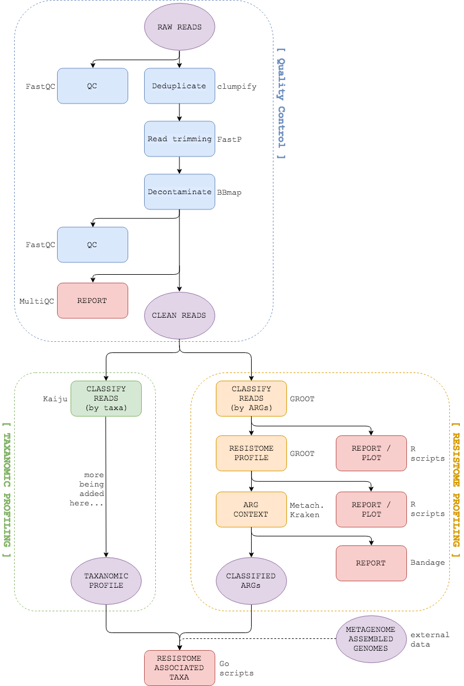

<div align="center">
  
  <h3><a style="color:#780200">D</a>etecting <a style="color:#780200">R</a>esistome <a style="color:#780200">A</a>ssociated ta<a style="color:#780200">X</a>a </h3>
  <hr>
  <a href="https://travis-ci.org/will-rowe/drax"></a>
  <a href="https://www.nextflow.io"></a>
  <a href="https://github.com/will-rowe/drax/blob/master/LICENSE"></a>
</div>

***

`DRAX is currently under active development -- please check back soon.`

## Overview

`DRAX` is a [Nextflow](https://www.nextflow.io) pipeline to detect resistome associated taxa in metagenomes. It identifies Antimicrobial Resistance Genes (ARGs) using [GROOT](https://www.biorxiv.org/content/early/2018/02/28/270835), extracts the genomic environment of each ARG using [Metacherchant](https://academic.oup.com/bioinformatics/article-abstract/34/3/434/4575138?redirectedFrom=fulltext) and then performs taxanomic classification of assembled environments. Further pipeline steps and full documentation are being added.

## Installation

### Bioconda

For ease of use, the `DRAX` pipeline is called by a wrapper script that allows you to either download the required reference data, run the `DRAX` [Nextflow](https://www.nextflow.io) pipeline or update the pipeline. It is easiest to install `DRAX` using [Bioconda](https://bioconda.github.io/):

```
conda install drax -c bioconda
```

### Containers

You can also run `DRAX` using containers instead of conda. This will bypass the wrapper script so you will need to download the required reference data yourself.

```
# Install Nextflow
curl -s https://get.nextflow.io | bash

# Run DRAX with Docker
./nextflow run will-rowe/drax --reads 'tests/*R{1,2}.fq.gz' -profile docker

# OR run DRAX with Singularity
./nextflow run will-rowe/drax --reads 'tests/*R{1,2}.fq.gz' -with-singularity 'docker://wpmr/drax'
```

## Quick Start

The first time you use `DRAX`, you will need to get the required data:

```
drax get
```

* this will download several databases (masked hg19 for decontamination, ResFinder for GROOT, Kaiju RefSeq DB...)
* it can take a little while (databases total ~10GB compressed)
* you only need to do this **once**
* the default directory is `./DRAX-files` but you can rename/move it later
* this command will also update the pipeline to the most current version

Now you can run `DRAX`:

```
drax --reads 'tests/*R{1,2}.fq.gz' --refData ./DRAX-files
```

For a full list of options, just run:

```
drax --help
```

Also, read the [documentation](/docs) for a more detailed overview of `DRAX`.

## Workflow



## Documentation

The `DRAX` pipeline comes with documentation about the pipeline, found in the [docs](/docs) directory. This is still being added to as the pipeline is developed.
